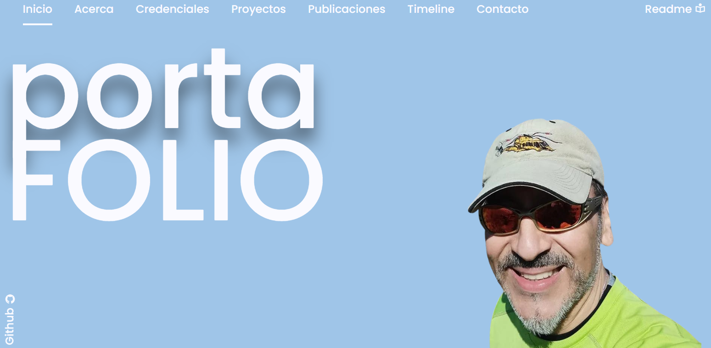

[]

<svg xmlns="http://www.w3.org/2000/svg" width="108" height="20" role="img" aria-label="any text: you like"><title>any text: you like</title><filter id="blur"><feGaussianBlur stdDeviation="16"/></filter><linearGradient id="s" x2="0" y2="100%"><stop offset="0" stop-color="#bbb" stop-opacity=".1"/><stop offset="1" stop-opacity=".1"/></linearGradient><clipPath id="r"><rect width="108" height="20" rx="3"/></clipPath><g clip-path="url(#r)"><rect width="55" height="20" fill="#555"/><rect x="55" width="53" height="20" fill="#007ec6"/><rect width="108" height="20" fill="url(#s)"/></g><g fill="#fff" text-anchor="middle" font-family="Verdana,Geneva,DejaVu Sans,sans-serif" text-rendering="geometricPrecision" font-size="110"><g transform="scale(.1)"><g aria-hidden="true" fill="#010101"><text x="285" y="150" fill-opacity=".8" filter="url(#blur)" textLength="450">any text</text><text x="285" y="150" fill-opacity=".3" textLength="450">any text</text></g><text x="285" y="140" textLength="450">any text</text></g><g transform="scale(.1)"><g aria-hidden="true" fill="#010101"><text x="805" y="150" fill-opacity=".8" filter="url(#blur)" textLength="430">you like</text><text x="805" y="150" fill-opacity=".3" textLength="430">you like</text></g><text x="805" y="140" textLength="430">you like</text></g></g></svg>

<svg xmlns="http://www.w3.org/2000/svg" width="108" height="20" role="img" aria-label="any text: you like"><title>any text: you like</title><filter id="blur"><feGaussianBlur stdDeviation="16"/></filter><linearGradient id="s" x2="0" y2="100%"><stop offset="0" stop-color="#bbb" stop-opacity=".1"/><stop offset="1" stop-opacity=".1"/></linearGradient><clipPath id="r"><rect width="108" height="20" rx="3"/></clipPath><g clip-path="url(#r)"><rect width="55" height="20" fill="#555"/><rect x="55" width="53" height="20" fill="#007ec6"/><rect width="108" height="20" fill="url(#s)"/></g><g fill="#fff" text-anchor="middle" font-family="Verdana,Geneva,DejaVu Sans,sans-serif" text-rendering="geometricPrecision" font-size="110"><g transform="scale(.1)"><g aria-hidden="true" fill="#010101"><text x="285" y="150" fill-opacity=".8" filter="url(#blur)" textLength="450">any text</text><text x="285" y="150" fill-opacity=".3" textLength="450">any text</text></g><text x="285" y="140" textLength="450">any text</text></g><g transform="scale(.1)"><g aria-hidden="true" fill="#010101"><text x="805" y="150" fill-opacity=".8" filter="url(#blur)" textLength="430">you like</text><text x="805" y="150" fill-opacity=".3" textLength="430">you like</text></g><text x="805" y="140" textLength="430">you like</text></g></g></svg>

any text: you like - https://img.shields.io/badge/any_text-you_like-blue

https://img.shields.io/badge/any_text-you_like-blue

<title>Google Calendar</title><path d="M18.316 5.684H24v12.632h-5.684V5.684zM5.684 24h12.632v-5.684H5.684V24zM18.316 5.684V0H1.895A1.894 1.894 0 0 0 0 1.895v16.421h5.684V5.684h12.632zm-7.207 6.25v-.065c.272-.144.5-.349.687-.617s.279-.595.279-.982c0-.379-.099-.72-.3-1.025a2.05 2.05 0 0 0-.832-.714 2.703 2.703 0 0 0-1.197-.257c-.6 0-1.094.156-1.481.467-.386.311-.65.671-.793 1.078l1.085.452c.086-.249.224-.461.413-.633.189-.172.445-.257.767-.257.33 0 .602.088.816.264a.86.86 0 0 1 .322.703c0 .33-.12.589-.36.778-.24.19-.535.284-.886.284h-.567v1.085h.633c.407 0 .748.109 1.02.327.272.218.407.499.407.843 0 .336-.129.614-.387.832s-.565.327-.924.327c-.351 0-.651-.103-.897-.311-.248-.208-.422-.502-.521-.881l-1.096.452c.178.616.505 1.082.977 1.401.472.319.984.478 1.538.477a2.84 2.84 0 0 0 1.293-.291c.382-.193.684-.458.902-.794.218-.336.327-.72.327-1.149 0-.429-.115-.797-.344-1.105a2.067 2.067 0 0 0-.881-.689zm2.093-1.931l.602.913L15 10.045v5.744h1.187V8.446h-.827l-2.158 1.557zM22.105 0h-3.289v5.184H24V1.895A1.894 1.894 0 0 0 22.105 0zm-3.289 23.5l4.684-4.684h-4.684V23.5zM0 22.105C0 23.152.848 24 1.895 24h3.289v-5.184H0v3.289z"/></svg>/English?style=for-the-badge&color=green">

https://img.shields.io/badge/play-station-blue.svg?logo=data:image/svg%2bxml;base64,PHN2ZyB4bWxucz0iaHR0cDovL3d3dy53My5vcmcvMjAwMC9zdmciIHZlcnNpb249IjEiIHdpZHRoPSI2MDAiIGhlaWdodD0iNjAwIj48cGF0aCBkPSJNMTI5IDExMWMtNTUgNC05MyA2Ni05MyA3OEwwIDM5OGMtMiA3MCAzNiA5MiA2OSA5MWgxYzc5IDAgODctNTcgMTMwLTEyOGgyMDFjNDMgNzEgNTAgMTI4IDEyOSAxMjhoMWMzMyAxIDcxLTIxIDY5LTkxbC0zNi0yMDljMC0xMi00MC03OC05OC03OGgtMTBjLTYzIDAtOTIgMzUtOTIgNDJIMjM2YzAtNy0yOS00Mi05Mi00MmgtMTV6IiBmaWxsPSIjZmZmIi8+PC9zdmc+

[[Jota Cordova](https://img.shields.io/badge/play-station-blue.svg?logo=data:image/svg%2bxml;base64,PHN2ZyB4bWxucz0iaHR0cDovL3d3dy53My5vcmcvMjAwMC9zdmciIHZlcnNpb249IjEiIHdpZHRoPSI2MDAiIGhlaWdodD0iNjAwIj48cGF0aCBkPSJNMTI5IDExMWMtNTUgNC05MyA2Ni05MyA3OEwwIDM5OGMtMiA3MCAzNiA5MiA2OSA5MWgxYzc5IDAgODctNTcgMTMwLTEyOGgyMDFjNDMgNzEgNTAgMTI4IDEyOSAxMjhoMWMzMyAxIDcxLTIxIDY5LTkxbC0zNi0yMDljMC0xMi00MC03OC05OC03OGgtMTBjLTYzIDAtOTIgMzUtOTIgNDJIMjM2YzAtNy0yOS00Mi05Mi00MmgtMTV6IiBmaWxsPSIjZmZmIi8+PC9zdmc+)](jorge.cordovaj@gmail.com)

<!-- HEADER -->

https://img.shields.io/badge/logo-javascript-blue?logo=javascript

- 

https://img.shields.io/badge/play-station-blue.svg?logo=data:image/svg%2bxml;base64,PHN2ZyB4bWxucz0iaHR0cDovL3d3dy53My5vcmcvMjAwMC9zdmciIHZlcnNpb249IjEiIHdpZHRoPSI2MDAiIGhlaWdodD0iNjAwIj48cGF0aCBkPSJNMTI5IDExMWMtNTUgNC05MyA2Ni05MyA3OEwwIDM5OGMtMiA3MCAzNiA5MiA2OSA5MWgxYzc5IDAgODctNTcgMTMwLTEyOGgyMDFjNDMgNzEgNTAgMTI4IDEyOSAxMjhoMWMzMyAxIDcxLTIxIDY5LTkxbC0zNi0yMDljMC0xMi00MC03OC05OC03OGgtMTBjLTYzIDAtOTIgMzUtOTIgNDJIMjM2YzAtNy0yOS00Mi05Mi00MmgtMTV6IiBmaWxsPSIjZmZmIi8+PC9zdmc+

[wwjotacordovaj]([http://www.linkedin.com/in/jotacordovaj](https://img.shields.io/badge/play-station-blue.svg?logo=data:image/svg%2bxml;base64,PHN2ZyB4bWxucz0iaHR0cDovL3d3dy53My5vcmcvMjAwMC9zdmciIHZlcnNpb249IjEiIHdpZHRoPSI2MDAiIGhlaWdodD0iNjAwIj48cGF0aCBkPSJNMTI5IDExMWMtNTUgNC05MyA2Ni05MyA3OEwwIDM5OGMtMiA3MCAzNiA5MiA2OSA5MWgxYzc5IDAgODctNTcgMTMwLTEyOGgyMDFjNDMgNzEgNTAgMTI4IDEyOSAxMjhoMWMzMyAxIDcxLTIxIDY5LTkxbC0zNi0yMDljMC0xMi00MC03OC05OC03OGgtMTBjLTYzIDAtOTIgMzUtOTIgNDJIMjM2YzAtNy0yOS00Mi05Mi00MmgtMTV6IiBmaWxsPSIjZmZmIi8+PC9zdmc+))

# 👋 Hi, I'm Jota Córdova

https://img.shields.io/badge/play-station-blue.svg?logo=data:image/svg%2bxml;base64,PHN2ZyB4bWxucz0iaHR0cDovL3d3dy53My5vcmcvMjAwMC9zdmciIHZlcnNpb249IjEiIHdpZHRoPSI2MDAiIGhlaWdodD0iNjAwIj48cGF0aCBkPSJNMTI5IDExMWMtNTUgNC05MyA2Ni05MyA3OEwwIDM5OGMtMiA3MCAzNiA5MiA2OSA5MWgxYzc5IDAgODctNTcgMTMwLTEyOGgyMDFjNDMgNzEgNTAgMTI4IDEyOSAxMjhoMWMzMyAxIDcxLTIxIDY5LTkxbC0zNi0yMDljMC0xMi00MC03OC05OC03OGgtMTBjLTYzIDAtOTIgMzUtOTIgNDJIMjM2YzAtNy0yOS00Mi05Mi00MmgtMTV6IiBmaWxsPSIjZmZmIi8+PC9zdmc+

ICT Strategy • Digital Transformation • AI Adoption • Multi-Agent Systems • Operations & Multi-Stack Integration

Senior ICT executive and consultant with 20+ years of experience leading complex technology environments across Latin America, spanning telecommunications, government, public safety, fintech, retail, mining, and multinational corporate ecosystems.

I specialize in bridging business strategy, digital transformation, AI-driven architectures, hyperscalers, and operational execution for organizations running mission-critical, high-availability systems.

---

## 🧭 Professional Overview

With a multidisciplinary background across technology, operations, business development, and innovation, I help organizations to define, deploy, and scale modern technology strategies through:

- ICT strategy, governance, and multi-country operations
- Digital transformation with AI-first approaches
- High-stakes project recovery and operational excellence
- Hyperscaler enablement (AWS, Azure, GCP)
- Multi-stack architecture and integration
- Data-driven value creation (BI, analytics, automation)
- Leadership of distributed, multicultural teams

👉 My career blends technical depth, business acumen, and execution, enabling organizations to evolve securely and competitively.

---

## 🤖 AI & Intelligent Systems Expertise

Strong focus on applied AI, LLM-based systems, and next-generation architectures:

- 🧠 Design and implementation of RAG (Retrieval-Augmented Generation) systems
- 🔗 Orchestration frameworks:
  - LangChain
  - LlamaIndex / Ollama-based pipelines
- 🤖 Development of multi-agent systems in Python:
  - Task decomposition
  - Tool-using agents
  - Autonomous workflows
- ☁️ Azure AI Foundry / Azure OpenAI integration for enterprise-grade AI solutions
- 🧩 Prompt engineering, evaluation, and optimization
- 📚 Vector databases & semantic search:
  - FAISS (local prototyping)
  - Cloud vector DBs (Pinecone, others)
- 🔄 End-to-end AI pipelines:
  - ingestion → embeddings → retrieval → generation

👉 Focus on real-world AI adoption, not just experimentation.

---

## 💼 Areas of Expertise

### 📌 Strategic & Organizational

- ICT strategy & governance
- Business optimization & financial planning
- P&L, budgeting, business cases
- Contract negotiation & vendor management
- Multinational operations
- Mission-critical environments (9-1-1, ITS, government automation)
- GenAIOps, FinOps

---

### 📌 Technology & Engineering

- Multi-stack integration (cloud, on-prem, hybrid)
- Hyperscalers: AWS, Azure, GoogleCloud
- AI / ML / LLM architectures
- RAG systems & intelligent assistants
- Cybersecurity, risk & compliance
- Dataplatforms: SQL/NoSQL, Hadoop, Spark, Hive, Pentaho
- Scalable software architecture

---

### 📌 Transformation & Innovation

- Digital transformation roadmaps
- AI adoption strategies (enterprise & operational)
- Automation (RPA/BPM), IoT, Industry 4.0
- Data as an asset (BI/analytics)
- Lean IT, Agile, DevOps/GenAI practices

---

## 🛠 Relevant Projects & Contributions

### 📌 AI & IntelligentSystems

- Developmentof RAG-based chatbots using LangChain + FAISS
- Prototyping multi-agent orchestration systems in Python
- AI-powered knowledge assistants for enterprise use cases
- Integration of LLMs in to operational and business workflows

---

### 📌 Public Safety & Government

- National 9-1-1 Automation (CostaRica)
- Public Safety Automation Projects: Mexico, Colombia, Panama, USA, BVI, Bolivia
- TranSantiago
- Digital Fonasa (Chile)
- SRCEI, Biblioredes, EFE Transportation Systems

---

### 📌 Telecom & Multinational Integrations

- VAS / multi-stack integrations for:
  - Kolbi, Claro, Tigo/Millicom, Movistar, C&W, ETB, Entel, Telmex
  - Carrier-grade IoT and telemetry platforms

---

### 📌 Corporate, Mining & Industrial

- Digital transformation for:
  - Codelco, Mantos Blancos, Pelambres, QB
  - Technology risk management (Santander Group)
  - Industrial IoT & BI solutions

---

### 📌 Software, Cloud & Data Innovation

- Multi-cloud adoption strategies
- Mission-critical systems architecture & migration
- Data governance & BI platforms

---

## 🎓 Education & Certifications Overview

- Computer Engineer
- Business Administration
- MBA (Thesis Pending)

Additional certifications and diplomas:

- AI for Product Management
- BI & Analytics
- Lean Six Sigma
- Scrum
- Postman API Expert
- AWS Machine Learning & Cloud Foundations
- Full Stack Python

---

## 🔧 Technical Stack & Tools

### ☁️ Cloud

    AWS • Azure • GCP • Azure AI Foundry • Azure OpenAI

### 🤖 AI / LLM

   LangChain • LlamaIndex • OpenRouter • Ollama • RAG Architectures • Prompt Engineering • Claude 

### 💻 Programming

    Python • Java • Kotlin • JavaScript • Bash• Apex

### 📊 Data

    Python • SQL/NoSQL • Hadoop • Spark • Hive • Pentaho • PowerBI • Looker• Tableau

### ⚙️ Dev & Ops

    Docker • Git • APIs • CI/CD

### 🔄 Processes

    Agile • BPM • RPA • ITSM • ISO 27001 • ISO 20000 • ISO 22301 • BCM

### 🌍 Domains

    Telcos • Public Safety Automation • eHealth • Fintech • Retail • Government • Mining

### 🏢 Enterprise Platforms

    SAP • Dynamics • Salesforce

---

## 📁 Portfolio Apps, Projects & Prototypes

| Technology                     | Description                  | Project                                |
| ------------------------------ | ---------------------------- | -------------------------------------- |
| Python/Streamlit               | Academic project             | "TollPaymentSoftware"                  |
| Android/Kotlin                 | Personal finance             | "MisLucas"                             |
| Android/Kotlin                 | Personal assistant           | "GesTareaV5"                           |
| Android/Kotlin                 | API integration              | "ApiNews"                              |
| Android/Kotlin                 | eHealth Homecare solution    | "MayorCuidado"                         |
| Azure AI/Python/TS             | AI Scientific Assitant       | "ALMA-Scientific AI Assistant "        |
| Edge AI/Gemma/Yolo             | Public Safety AI Assitant    | "SentinelEdge AI Security Copilot"     |
| GoogleGenAI/Gemini             | Lifestyle                    | "Recipes from images"                  |
| LangChain/Python/Render/OpenAi | Chatbox RAG                  | "Specialized RAG AI Assitant"          |
| Java                           | Intelligent Logistic Systems | "LMLS - Last Mile Logistic System      |
| Java                           | OSH/OHS Project              | "OSH/OHS Consulting Management System" |

---

## 🌐 Connect with Me

📧 Email: [Jota Cordova](jorge.cordovaj@gmail.com)

🌍 Location: Santiago, Chile

🔗 LinkedIn: [wwjotacordovaj](http://www.linkedin.com/in/jotacordovaj)

🌐 Portfolio: [jcordovaj.github.io/](https://jcordovaj.github.io/)

---

## ⭐ Final Note

I'm currently focused on bridging enterprise ICT strategy with applied AI, especially in:

- RAG systems
- Multi-agent orchestration
- AI-powered operations

Open to collaborating on **high-impact, scalable, AI-driven solutions** .
